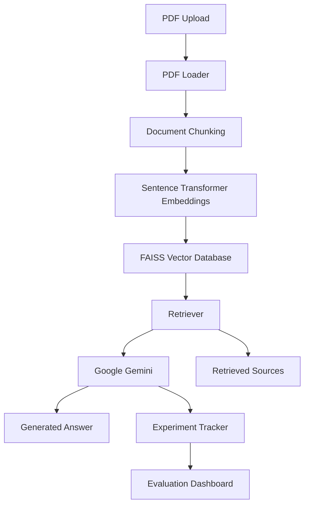

# 🔬 RAG Research Lab

A research-oriented **Retrieval-Augmented Generation (RAG)** platform for scientific literature question answering, document retrieval, and performance evaluation.

Built using **Streamlit, FAISS, LangChain, Hugging Face Embeddings, and Google Gemini**, the platform enables users to upload research papers, generate semantic embeddings, retrieve relevant document chunks, and obtain source-grounded answers from a Large Language Model.

---

## 🚀 Features

### 📄 Research Paper Processing

* Upload PDF research papers
* Automatic text extraction
* Page-level document metadata
* Scientific document ingestion

### ✂️ Intelligent Chunking

* Configurable chunk sizes

  * 256
  * 512
  * 1024
* Adjustable overlap settings
* Chunk statistics generation

### 🧠 Semantic Retrieval

* Sentence Transformer embeddings
* FAISS vector database
* Similarity-based retrieval
* Fast semantic search

### 🤖 Gemini-Powered Question Answering

* Context-aware responses
* Research paper analysis
* Scientific summarization
* Source-grounded answers

### 📊 Evaluation Dashboard

* Experiment tracking
* Retrieval latency analysis
* Generation latency analysis
* Chunk-size benchmarking
* Performance visualization

### 🔍 Research Insights

* Comparative chunking experiments
* Retrieval effectiveness monitoring
* Performance trend analysis
* Experimental reporting

---

# 🏗 Architecture



---

# ⚙️ Technology Stack

## Frontend

* Streamlit

## Backend

* Python

## LLM

* Google Gemini

## Vector Database

* FAISS

## Embeddings

* all-MiniLM-L6-v2

## Frameworks

* LangChain

## Visualization

* Pandas
* Matplotlib

## PDF Processing

* PyMuPDF

---

# 📁 Project Structure

```text
rag-research-lab/

├── app.py
│
├── modules/
│   ├── pdf_loader.py
│   ├── chunker.py
│   ├── embeddings.py
│   ├── vector_store.py
│   ├── retriever.py
│   ├── gemini_client.py
│   └── experiment_tracker.py
│
├── experiments/
│   └── experiments.csv
│
├── screenshots/
│   ├── upload.png
│   ├── chunking.png
│   ├── qa.png
│   ├── evaluation1.png
│   ├── evaluation2.png
│   └── evaluation3.png
│
├── README.md
├── requirements.txt
├── .env
└── .env.example
```

---

# 🧪 Experimental Setup

## Dataset

Research papers used:

* Retrieval-Augmented Generation for Knowledge-Intensive NLP Tasks
* ReAct: Synergizing Reasoning and Acting in Language Models
* Toolformer: Language Models Can Teach Themselves to Use Tools

## Embedding Model

```text
all-MiniLM-L6-v2
```

## Vector Store

```text
FAISS
```

## LLM

```text
Google Gemini
```

## Chunk Sizes Evaluated

```text
256
512
1024
```

---

# 📈 Experimental Results

## Chunk Size Comparison

| Chunk Size | Retrieval Latency | Total Latency |
| ---------- | ----------------- | ------------- |
| 256        | 0.048 s           | 6.56 s        |
| 512        | 0.026 s           | 7.37 s        |
| 1024       | 0.026 s           | 7.84 s        |

---

## Observations

### Retrieval Performance

* Larger chunks reduced retrieval overhead.
* FAISS retrieval remained extremely fast across all chunk sizes.

### Response Generation

* Larger chunks increased total generation latency.
* Additional context improved answer grounding but required more processing.

### Optimal Configuration

Based on experiments:

```text
Chunk Size = 512
```

provided the best balance between:

* Retrieval speed
* Context quality
* Response latency

---

# 📊 Chunk Statistics

The system automatically computes:

* Number of chunks
* Chunk size distribution
* Average chunk length
* Document coverage

These statistics help evaluate chunking strategies and retrieval effectiveness.

---

# 🔍 Retrieval Score Visualization

The platform visualizes:

* Retrieved chunks
* Similarity scores
* Retrieval ranking

This enables transparent analysis of document retrieval quality.

---

# 📚 Source-Grounded Answers

Generated answers are accompanied by:

* Retrieved document excerpts
* Page references
* Source citations

This ensures:

* Explainability
* Transparency
* Hallucination reduction

---

# 💬 Example Questions

### General Understanding

* What problem does this paper solve?
* Summarize the main contribution.
* What methodology is proposed?

### Evaluation

* What datasets were used?
* What metrics were reported?
* How does the model perform compared to baselines?

### Research Analysis

* What limitations are discussed?
* What future work is suggested?
* What are the key findings?

---

# 📸 Screenshots

## Document Upload & Processing


---

## Vector Database Creation


---

## Question Answering


---

## Evaluation Dashboard


---

## Retrieval Performance


---

## Latency Analysis


---

# 🔐 Environment Variables

Create a `.env` file:

```env
GEMINI_API_KEY=your_api_key_here
```

Never commit real API keys to GitHub.

---

# ▶️ Installation

Clone the repository:

```bash
git clone https://github.com/YOUR_USERNAME/rag-research-lab.git
cd rag-research-lab
```

Create virtual environment:

```bash
python -m venv .venv
```

Activate environment:

### Windows

```bash
.venv\Scripts\activate
```

### Linux / macOS

```bash
source .venv/bin/activate
```

Install dependencies:

```bash
pip install -r requirements.txt
```

Run application:

```bash
streamlit run app.py
```

---

# 🎯 Resume Highlights

This project demonstrates:

* Retrieval-Augmented Generation (RAG)
* Large Language Model Integration
* Vector Databases (FAISS)
* Information Retrieval
* Semantic Search
* Experiment Design
* Performance Evaluation
* Scientific Document Analysis
* NLP Systems Engineering

---

# 🚀 Future Work

* Hybrid Search (BM25 + Vector Search)
* Cross-Encoder Reranking
* Multi-Agent Research Assistant
* RAGAS Evaluation Framework
* Multi-Paper Comparative Analysis
* Citation Network Visualization
* Research Gap Detection
* Automated Literature Reviews

---

# 👩‍💻 Author

**Shreya Somi**

Computer Science Undergraduate interested in:

* Artificial Intelligence
* Machine Learning
* Information Retrieval
* Retrieval-Augmented Generation
* AI Research Systems
