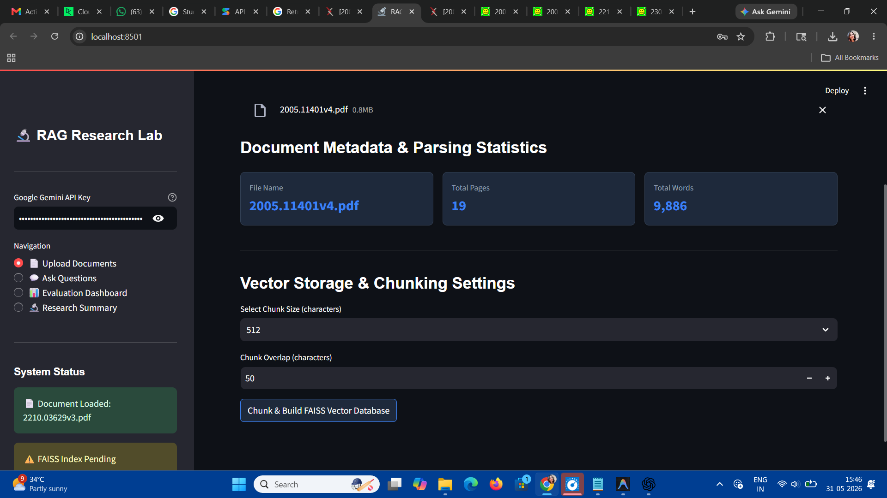
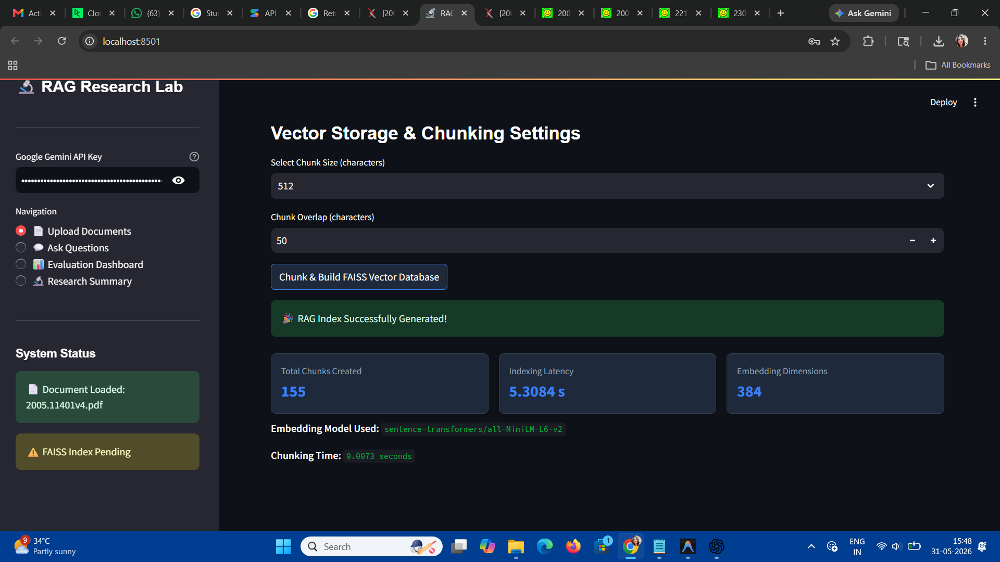
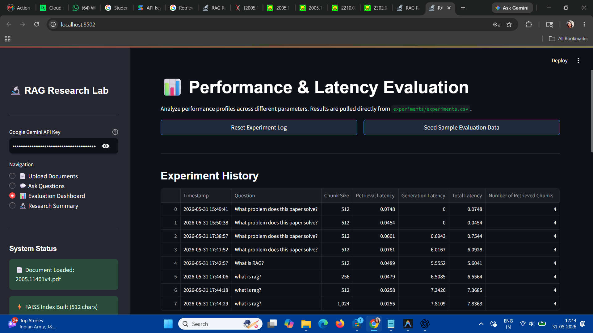
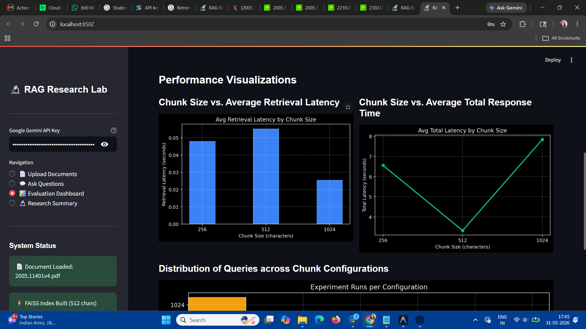
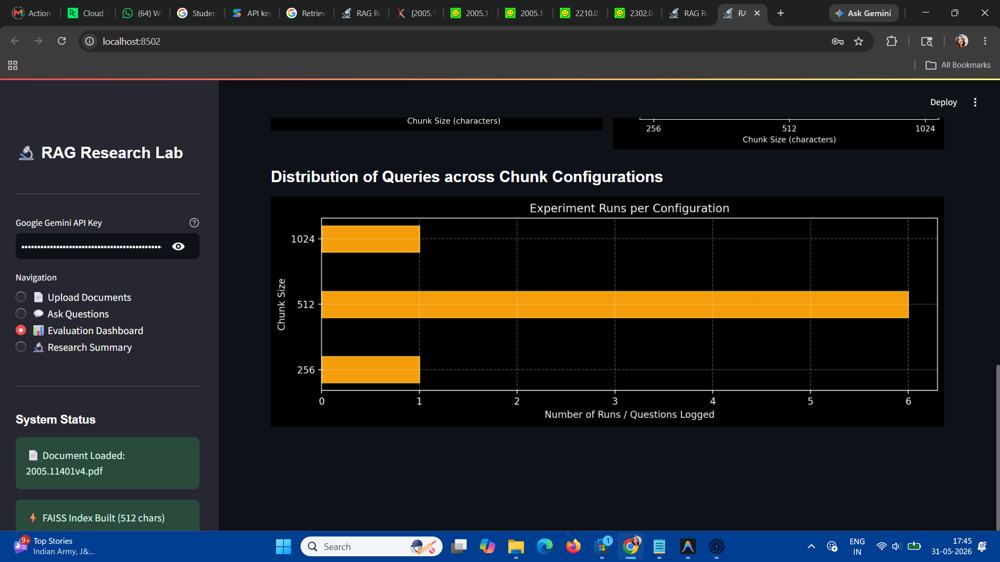

# RAG Research Lab

## Overview

A Retrieval-Augmented Generation (RAG) research platform built with:

- Streamlit
- LangChain
- FAISS
- HuggingFace Embeddings
- Google Gemini

## Features

- PDF document upload
- Document chunking experiments
- FAISS vector database
- Retrieval-Augmented Question Answering
- Chunk size evaluation dashboard
- Latency analysis

## Screenshots

### Document Upload & Parsing

### Vector Database Creation

### Question Answering

### Evaluation Dashboard

### Performance Charts

